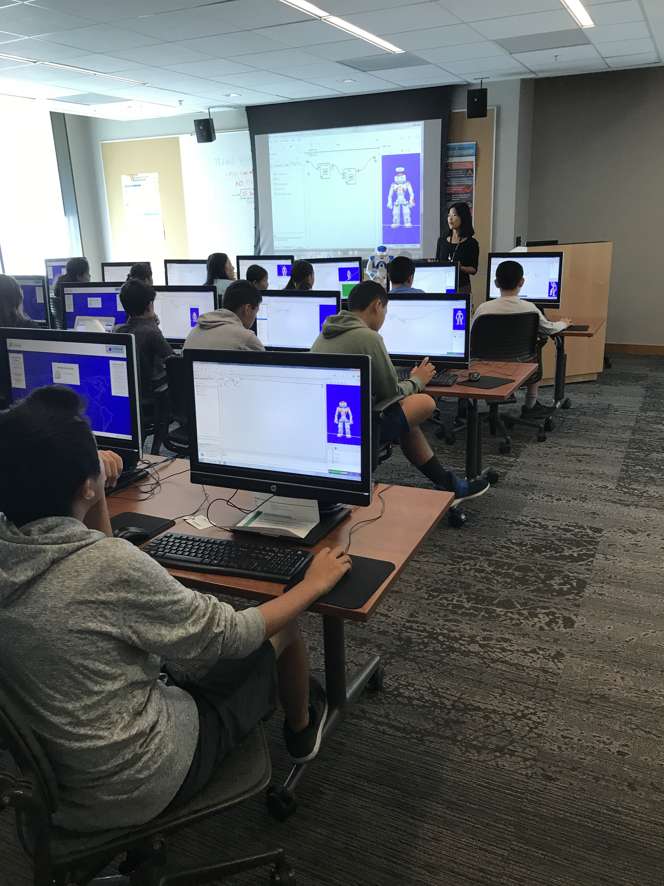
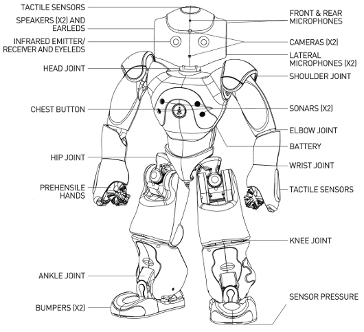

# ROBO DOJO

Tutorials for the humanoid NAO robot developed by Palo Alto City Library. Made possible through [Pacific Library Partnership Innovation Grant](http://www.plpinfo.org/innovation-grants/).

## Files

* Sample Application: [A personalized quiz](./Tutorial/PersonalityQuizRoboDojoEdition.crg)

* Sample Application: [Joker](./Tutorial/Joker.crg)

* [Tips and Tricks](./Tutorial/Handout_ Personality_Quiz.pdf)

## About NAO

Nao (pronounced now) is an autonomous, programmable humanoid robot developed by Aldebaran Robotics. Aldebaran Roboticswas acquired by Japan's SoftBank Mobile in 2013.

Nao robots have been used for research and education purposes in numerous academic institutions worldwide.

This tutorial is based on NAO version 5. 

Here is the specifications for Nao V5 Evolution (2014) :

Name | Value
--- | ---
Height	| 58 centimetres (23 in)
Weight	| 4.3 kilograms (9.5 lb)
Power supply | lithium battery providing 48.6 Wh
Autonomy | 90 minutes (active use)
Degrees of freedom | 25
CPU | Intel Atom @ 1.6 GHz
Built-in OS | NAOqi 2.0 (Linux-based)
Compatible OS | Windows, Mac OS, Linux
Programming languages | C++, Python, Java, MATLAB, Urbi, C, .Net
IDE | Choreographe
Sensors | Two HD cameras, four microphones, sonar rangefinder, two infrared emitters and receivers, inertial board, nine tactile sensors, eight pressure sensors
Connectivity | Ethernet, Wi-Fi
Spoken languages | Nao can speak [19 languages](http://doc.aldebaran.com/1-14/news/1.14.1/whatsnew.html)

## Operation System and Programming Language

Threre are different tools for different levels of users. The tutorials in this repository will mainly forcus on [Non-developers](#Non-developers) and [Beginner developers](#Beginner-developers).

### Non-developers

For non-developers there is the Integrated Development Environment (IDE) Choreographe. It’s a desktop application that allows you to control Nao using a simple drag and drop interface, including:

* Create animations, behaviors and dialogs
* Test them on a simulated robot or directly on a real one
* Monitor and control your robot

### Beginner developers

People with rudimentary programming skills can write Python code and add it to Choreographe. 

### Expert developers

Expert developers can choose from - C++, Python, MatLab and many more through their SDK’s. 

