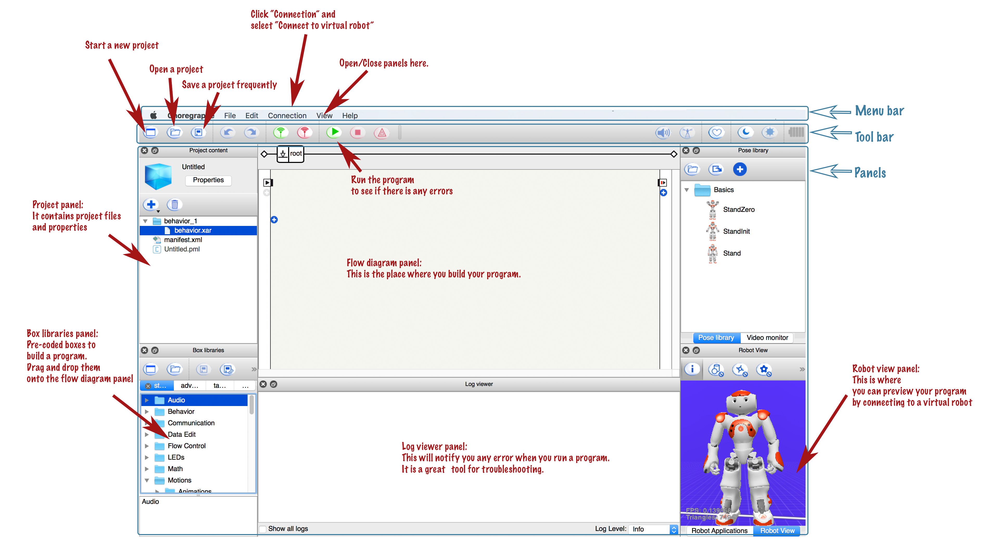
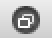
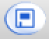
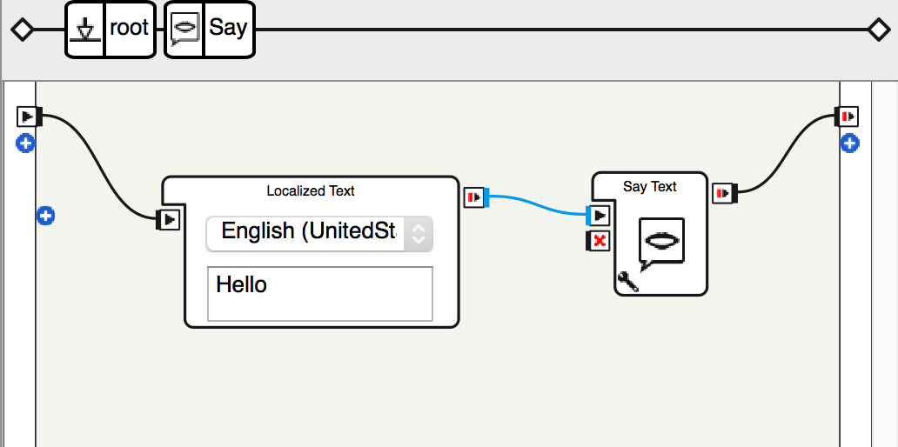
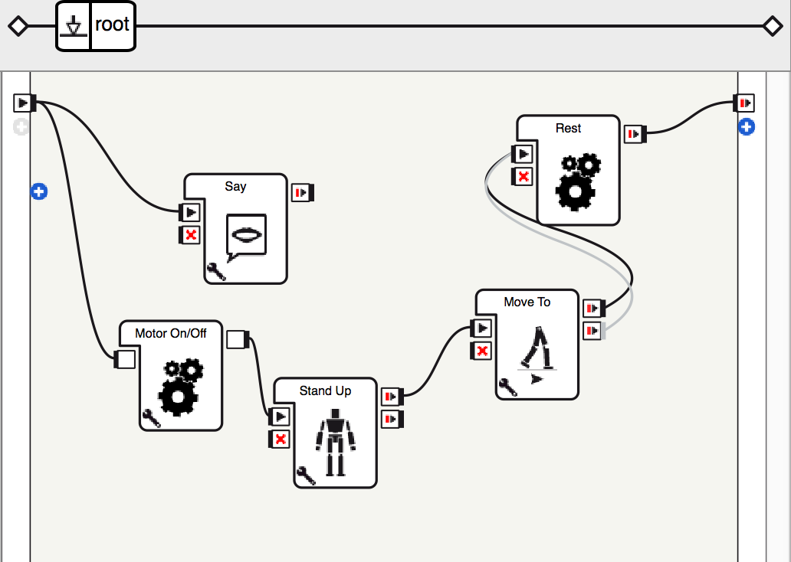

# Tutorial 1 -- Introduction of Choregraphe

Welcome to NAO robot programming. This tutorial covers the basics of using Choregraphe, a simple drag and rop interface for programming the humanoid robot NAO.

The beauty of Choregraphe lies in that you do not necessarily need a real robot sit next to you to develop your applications. Instead, most of the times, you can simply develop and test your application with the virtual robot inside the software.

## Objectives

* How to install Choregraphe
* How to make NAO speak and walk with Choregraphe

## Install Choregraphe

For Palo Alto City Library users, please follow the steps to download and install Choregraphe on your own computer:

1. Visit the [Aldebaran website](https://aldebaran.com/en) choose sign in then create an account.
2. After creating an account, download the Choreographe software.
3. Enter your [license key](https://library.cityofpaloalto.org/get-started-with-nao-robot/) during the installation of the software.

## Basics of Choregraphe

Open choregraphe on your computer. You will see an interface similar to the following:

The Choregraphe interface is composed of three major parts, the top menu bar, the tool bar underneath the menu bar, and the panels area. 

You will mainly use the panels area to program your application. There are many different panels, the ones you will use most frequently are the project panel, the box libraries panel, the flow diagram panel, the robot view panel, and the log viewer panel.

### Display/Hide Panels

You can control to display or to hide a certain panel by using the "View" menu item. For example, if a panel you want to use is missing on your Choregraphe interface, click "View" in the tope menu bar, and click the name of the panel you want to dislay. A checkmark will appear before the name of the panel, and the panel will open in the panels area.

### Toggle Panels

In the panels area, several panels can share a same place, and you can usually toggle the panel view by clicking on the panel name that is located at the bottom of the place. 

### Rearrange and Resize Panels

You can simply drag a panel around, and put it into desired place. You can also make a panel separate from the Choregraphe interface by clicking the  new panel button located on the left top corner of each panel. Once you click the button, the panel will become a stand-alone window, and you can resize it to have a clearer view of what is inside the panel -- I usually use this trick for the robot viewer panel, so I can monitor the virtual robot's movement more closely when testing an application.

### Connect to Virtual Robot

Click "Connection" on the top menu bar, and choose to "Connect to the virtual robot" if you have not done so yet. Once successfully connected, you are expected to see a robot appear in the robot viewer panel. 

If you do not see a robot viewer panel in the panels area, please refer to [Display/Hide Panels](#displayPanel) in the previous section.

### Make NAO Say Something

The first thing to do when you develop a new applilcation in Choregraphy is to click the  ***new project button*** on the tool bar. This will open a new blank project. 

We will start a new program for a very simple task to make NAO say something. 

In choregraphe, look at the box libraries panel. Navigate to Audio -> Voice, then drag and drop a “Say” box to the flow diagram panel. The flow diagram panel is the place where you will build your program and write your code.

To execute the “Say” box, we must connect it into the program “flow”. 

Click on the  ***start button*** to the left of the flow diagram panel, and drag a line to the  ***start button*** button on the left of the “Say” box. The boxes will be executed sequentially in the order that they are connected. 

The last box's  ***stop button*** should connect to the  ***stop button*** on the right hand side of the flow diagram panel. This will complete a "flow".

Finally, click the  ***play button*** on the tool bar. The virtual robot should have a text bubble dislaying on top of its head.

Click the  ***save button*** to save the project, and rename the project as "Hello World". It is always a good habit to constantly save the project during programming.

 *Related Resource* [1](#1)
 
### Make NAO Say Anything

We will do this by modifying the previous project.

Double click the say box in the flow diagram panel. A “Localized Text" box will appear connected to a “Say Text” box. To return to the previous screen, click “root” on the upper box.

Replace the “Hello” in the text box with “Hello World!” or anything you would like NAO to say.

Click the the  ***play button*** on the tool bar and see the result.

 *Related Resource* [1](#1)

### Make NAO Walk While Talking

We will do this by modifying the previous project.

Go to the root of the previous project. 

Look at the box libraries panel. Navigate to Motion, then drag and drop a “Motion On/Off” box, a "Stand Up" box, a "Walk to" box and a "Rest" box to the flow diagram panel. Connect the boxes in the following way:

As a note, the Motor on/off box will turn the stiffness of the motors on or off. Click the  wrench button at the lower left corner of the box and you can select the value for the parameter. By default, the parameter is set to "On", which means the robot will become stiff, so that you cannot move the robot’s joints manually.

Click the  ***play button*** on the tool bar and see the result. NAO will say something, walk for a few steps and then rest.

 *Related Resource* [2](#2)

 
## Exercise

* Try to click the  ***wrench button*** on each of the boxes, and play around with the parameters to get slightly different behaviors.
* Have NAO introduce itself.

---

<a name="1">1</a>: Download [HelloWorld.crg](HelloWorld.crg) and open it in your Choregraphe.

<a name="2">2</a>: Download [WalkSay.crg](Walksay.crg) and open it in your Choregraphe.

<h3 align="right"><a href="README2.md" >Next</a><h3>