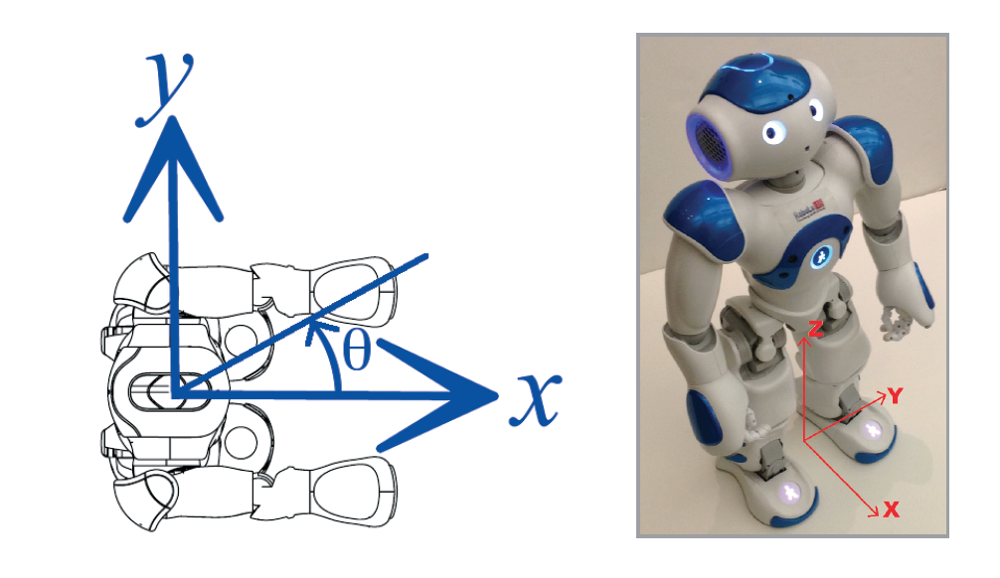
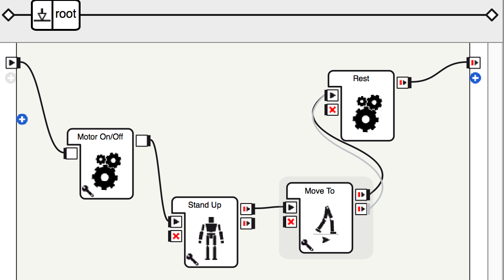

# Tutorial 2 -- Make NAO Walk in Shapes

## Objectives

* How to make NAO walk in different patterns using Choregraphe
* The (x, y) coordinate plane of NAO
* How to convert an (x, y) coordinate into an angle to turn, and a distance to walk
* How to make NAO turn and walk to an (x, y) point using Choregraphe

Anytime you have difficulty to read the interface of Choregraphe, please refer to the [interface graph in Tutorial 1](https://github.com/PaloAltoLibrary/NAO-Tutorials/blob/master/Tutorial%201/README.md#basics-of-choregraphe).

### The (x, y) Coordinate Plane of NAO

Axis | Direction
--- | --- 
X | Points forward
Y | Points to the left of the robot.
Z | Points up, perpendicular to both the x and y


The units of NAO’s (x, y) coordinate plane are meters.

***Quick quiz:*** What does (1, 2) mean?


In addition to points in the (x, y) coordinate plane, angles are also defined. An angle is measured counterclockwise from the x-axis, as shown by θ in the figure above.


### Move Around

The first thing to do as usual is to develope a new applilcation in Choregraphy. Click the  ***new project button*** on the tool bar. This will open a new blank project. 

We will start a new program for a very simple task to make NAO walk. 

In choregraphe, look at the box libraries panel. Search and drag four boxes to the flow diagram panel:

* ***Motor On/Off***
* ***Stand Up***
* ***Move To***
* ***Rest***

The flow diagram panel is the place where you will build your program and write your code.

Connect the boxes in the following way:

As a note, the ***Motor on/off*** box will turn the stiffness of the motors on or off. Click the  wrench button at the lower left corner of the box and you can select the value for the parameter. By default, the parameter is set to "On", which means the robot will become stiff, so that you cannot move the robot’s joints manually.

 *Related Resource* [1](#1)

#### Make the Robot Turn to a Direction

Click the  wrench button at the lower left corner of the ***Move To*** Box, and change the value of Theta, keep the values of x and y to be 0. 

Make sure Choreograph is connected to the virutal robot. Click the the  ***play button*** on the tool bar and see the result.

#### Make the Robot move to a certain point

Click the  wrench button at the lower left corner of the ***Move To*** Box, and change the value of x and y, and change the Theta value to 0. 

Make sure Choreograph is connected to the virutal robot. Click the the  ***play button*** on the tool bar and see the result.

#### Exercise

1. Imagine the robot's coordinate is at (0,0), try to set up the first ***Walk To*** box, so the robot will move to a spot that is 1 meter to the right and half meter forward.
2. Add another ***Walk To*** box to the flow diagram panel. Use trigonomitry to compute what angle the robot should turn and how far it should walk in order for the robot to go back to (0,0). Set the second box up, and run the behavior to see if the robot walks away and returns to the original spot.
3. Having NAO walk in square, triangle, or another different type of polygon.

---

<a name="1">1</a>: Download [Walk](Walk.crg) and open it in your Choregraphe.
