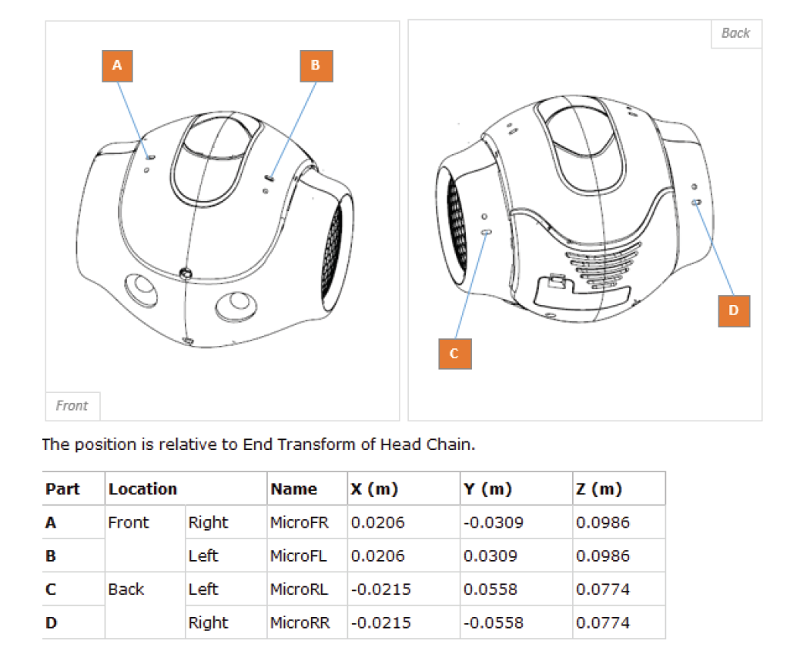
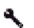
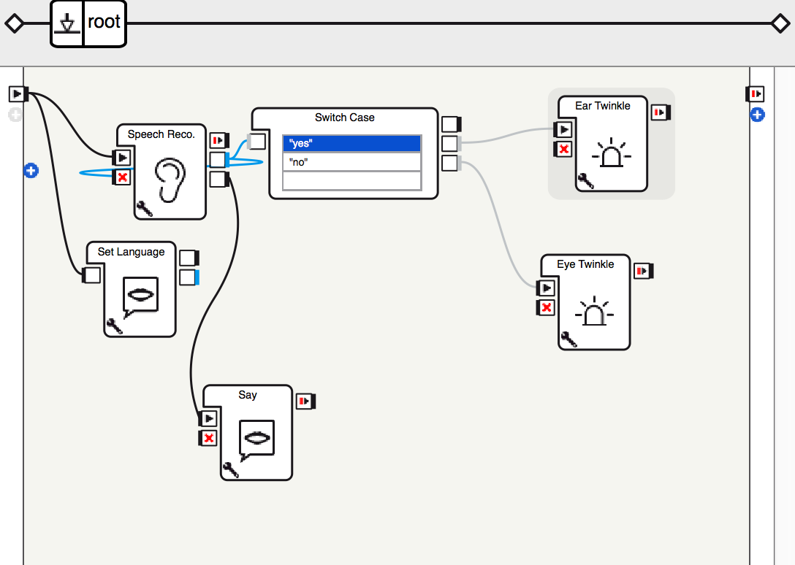
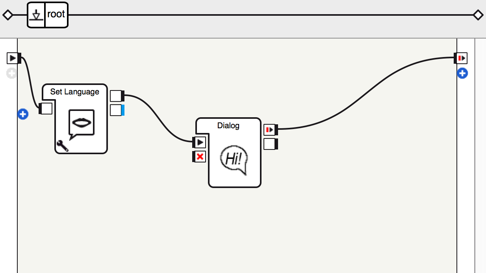

# Tutorial -- Let's Chat

## Objectives

* Understand what is speech recoginition
* Know how to perform speech recognition on NAO
* Know how to set up threshold of speech recoginition
* Know how to create a conversation with NAO

Anytime you have difficulty to read the interface of Choregraphe, please refer to the [interface graph in Tutorial 1](https://github.com/PaloAltoLibrary/NAO-Tutorials/blob/master/Tutorial%201/README.md#basics-of-choregraphe).

### Voice as a way to communicate

As a humanoid robot, some good ways to communicate with NAO are through touch and voice -- just like how humans. Isn't that cool?

But NAO does not hear with his ears, or talk with his mouth. What seem to be his ears at the side of his head are in fact his speakers, What seems to be his mouth is actually one of his eyes (one of the two cameras), What seem to be his eyes are mind control portals(infrared emitters), and his real ears(mic) are located on top of his head. What a camouflage! Good job, NAO.

However, unlike our ears that listen for sounds all the time, NAO has to be programmed to listen for sounds at specific times. After it hears sound , NAO can perform speech recognition to convert what it hears into words that it knows.

In order to do this, we need to teach NAO some words or even a dictionary, so it can express what it hears in words. The Words can be as simple as "yes" and "no". Once it captures the word, we can further use conditional programming to ask nao to carry out new behaviors. 

For example, NAO asks "Do you like chocolate?". If I answer "Yes", it will blink his ear LEDs. If I answer "no", it will blink his eye LEDs.

### Speech Recognition in Choregraphe

The first thing to do as usual is to develope a new applilcation in Choregraphy. Click the  ***new project button*** on the tool bar. This will open a new blank project[1](#1). 

We will start a new program for a very simple task to make NAO hear and recognize two words, "yes" and "no". 

In choregraphe, look at the box libraries panel. Search and drag four boxes to the flow diagram panel:

* ***Choices*** 
* ***Set Language***
* ***Switch Cases***
* ***Goto Posture*** (drag and drop two of these)

Next, we will configure the boxes a bit. 

Double click the Choices box. This will open up the two boxes inside it. In the Localized Text box, selelct language "Engish", enter a question the robot will ask, like "Do you like chocolate?". Click the  wrench button of the other box, theChoice box. By default, the word list is set to “yes" and "no”. The default threshold is set to 30%. The robot won't recognize a word if it is not sure enough. If you want Speech Recognition to be more tolerant, you can decrease the confidence level number.

Click `Root` on the top of the flow diagram panel to go back to the main view.

In the Switch Case box, enter `"yes"` with quotes in the first input field and `"no"` with quotes in the second input field. At the backend, the Switch Case box uses Python's If Else statement. In this case, if you said "yes", the robot will sit down. If you said "no", the robot will crouch.

Right click on the Goto Posture boxes, a drop down menu will come up. Select the menu item "Edit box", and change one box's name to "Sit", and the other one to "Crouch". Click the  wrench button of the Sit box, slect Name to be "Sit". Click the  wrench button of the Crouch box, slect Name to be "Crouch". 

Finally, connect the boxes in the following way:

 *Related Resource* [2](#2)

Click the the  ***play button*** on the tool bar and see the result. If you are connecting to a virtual robot, you can double click the input buttons to mimick the behavior. Then bring up the Diaglog box where you can enter text to have conversation with the virtual robot.

### Build a Converstaion with NAO

A more efficient way to make NAO interact with us verbally is to use the Dialog box.

We will start a new program to make NAO have a very simple conversation with us. 

In choregraphe, look at the box libraries panel. Search and drag four boxes to the flow diagram panel:

* ***Set Language***
* ***Dialog***

Connect the boxes in the following way:

Bring the `Project content` panel to the front, you will find an `ExampleDialog` folder. Inside the folder, you will find two files:

* ExampleDialog.dlg
* ExampleDialog_enu.top

The DLG file represents the Dialog topic and registering the supported languages, and the TOP file(s), each one containing the QiChat script of language supported by the Dialog topic. Inside the TOPfile(s), you can define conversation concepts, proposals and rules. For example, here is a short one to make the robot respond to greetings and the request of a joke:

	topic: ~introduction ()
	language:enu
	
	concept:(greetings) ^rand[hi hello "hey there"]
	concept:(joke_q) [[can would do] you {know} {"how to"} tell {me} {a} [joke jokes]	
	concept:(joke) ^rand["The past, present and future walked into a bar. It was tense." "I thought my neighbours were lovely people. Then they went and put a password on their wi-fi." "I've just opened a new restaurant called Karma. There's no menu, we just give you what you deserve."]
	
	u:(~greetings) ~greetings
	u:(joke_q) yes. ~joke
	
 *Related Resource* [3](#3)

Click the the  ***play button*** on the tool bar and see the result. If you are connecting to a virtual robot, you can double click the input buttons to mimick the behavior. Then bring up the Diaglog box where you can enter text to have conversation with the virtual robot.

#### Exercise

1. Make NAO introduce itself when you ask it to.
2. Have NAO ask “How are you?” Depending on what you say, NAO should have different replies.
3. Use voice commands to control the robot. You can ask it to provie answers to your questions etc..

---

#### Reference
3. [Documentation on Choregraphe Project](http://doc.aldebaran.com/1-14/software/choregraphe/objects/choregraphe_project.html)
1. Download [SpeechRec](SpeechRec.crg) and open it in your Choregraphe.
2. Download [Dialog](Dialog.crg) and open it in your Choregraphe.
2. <a href="http://doc.aldebaran.com/2-1/naoqi/audio/alspeechrecognition.html">Documentation on Speech recognition</a>
3. <a href="http://doc.aldebaran.com/2-1/naoqi/audio/dialog/aldialog.html">Documentation on Diaglog</a>
4. <a href="http://doc.aldebaran.com/2-1/naoqi/audio/dialog/aldialog_syntax_toc.html">Documentation on QiChat (syntax for topics and rules used by Dialog)</a> 

<h3 align="right"><a href="README4.md" >Next</a><h3>
