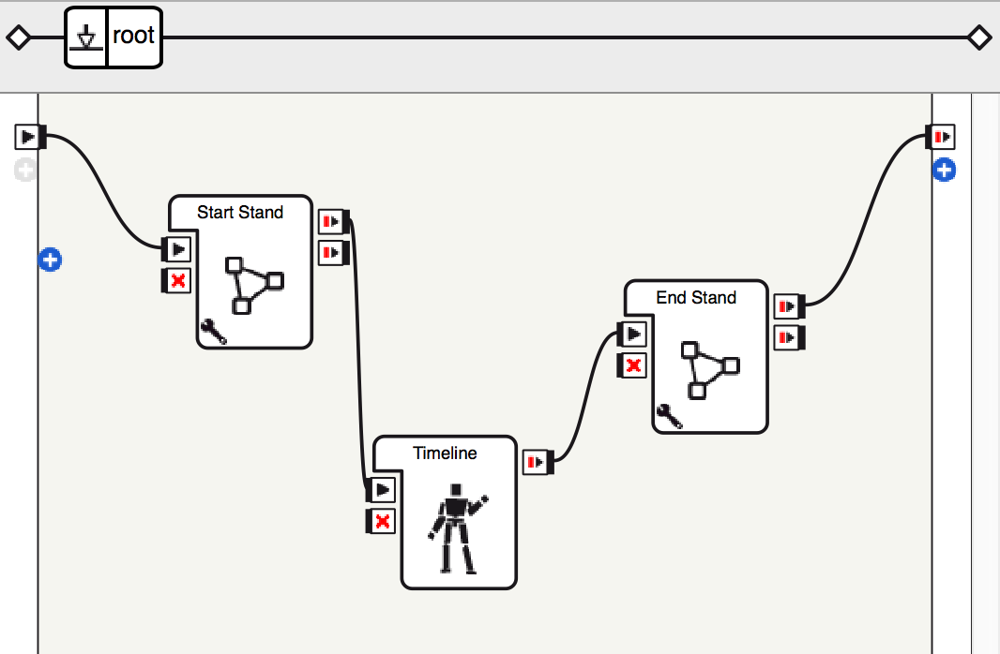
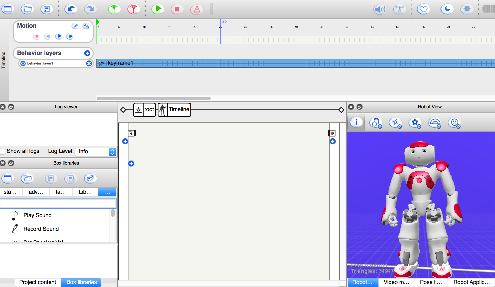
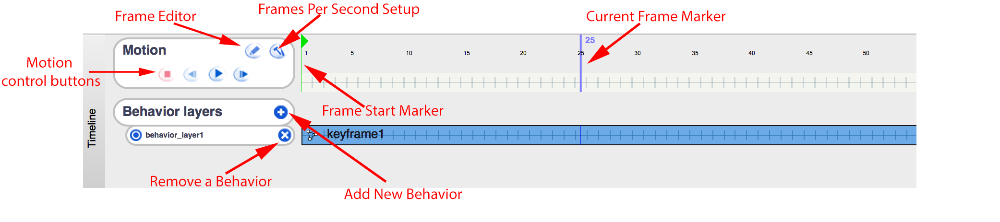
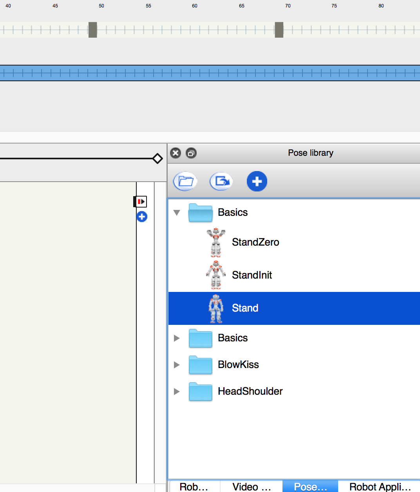
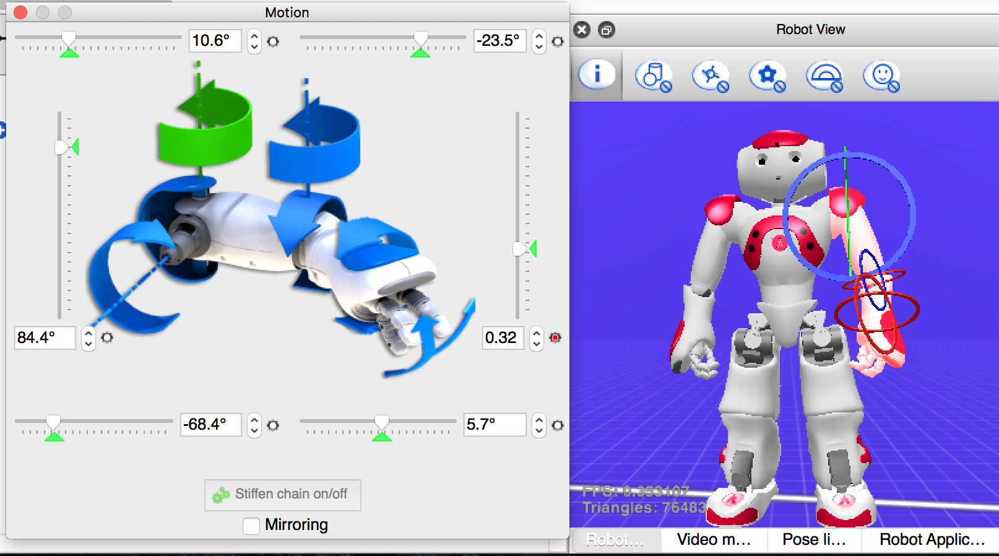
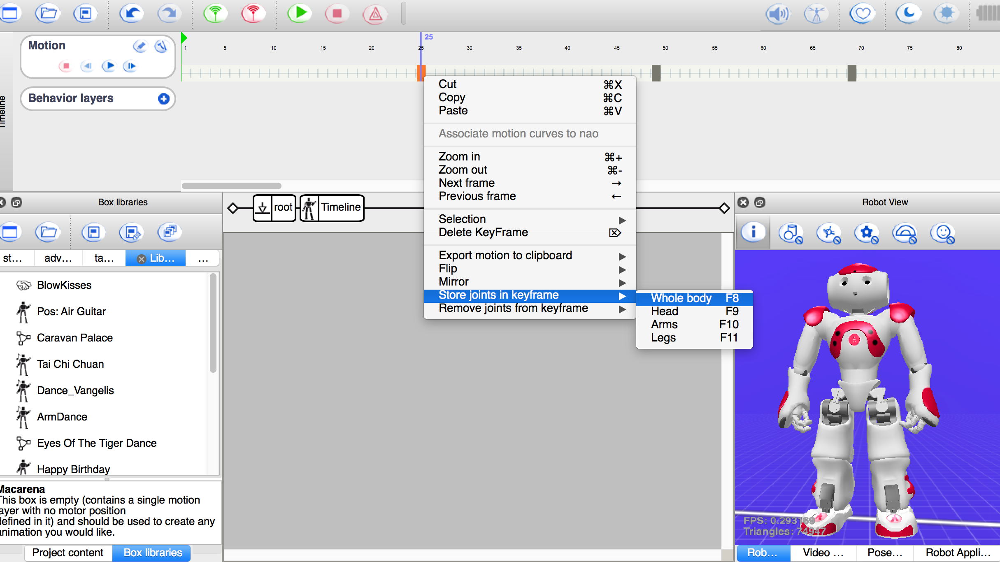
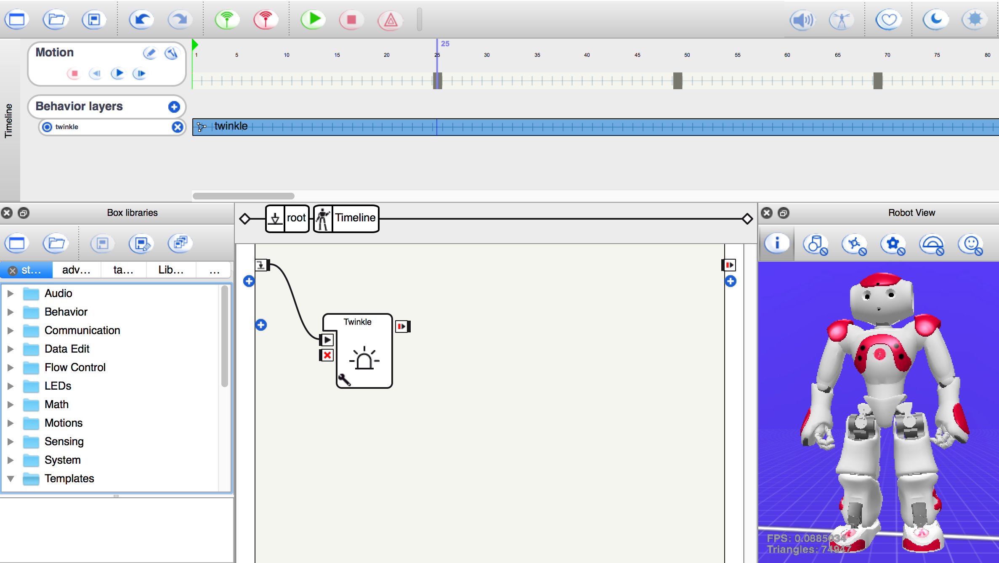
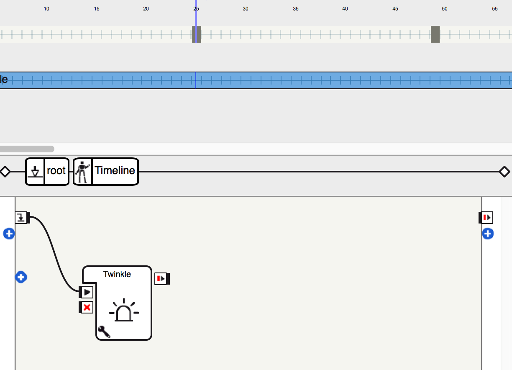
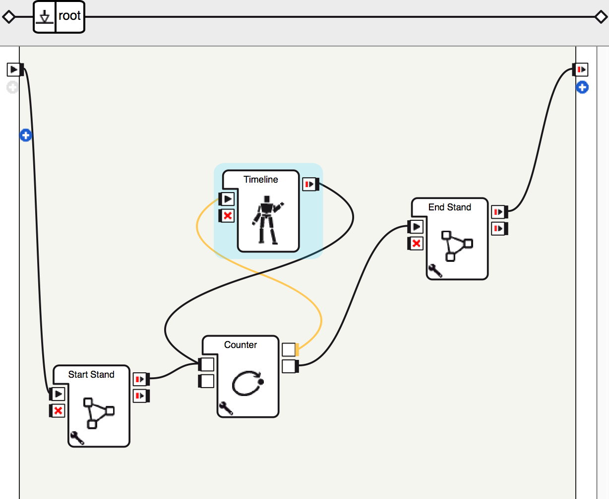

# Tutorial -- Let's Dance

## Objectives

* Understand the timeline box and what is a keyframe motion
* Learn how to keep NAO balenced in different poses
* Learn how to record NAO poses in keyframes
* Learn how to teach NAO dance
* Learn how to make NAO repeat a set of dance movements

Anytime you have difficulty to read the interface of Choregraphe, please refer to the [interface graph in Tutorial 1](https://github.com/PaloAltoLibrary/NAO-Tutorials/blob/master/Tutorial%201/README.md#basics-of-choregraphe).

### Keyframe Motion

As a humanoid robot, NAO is capable to move fluidly by using keyframes. A keyframe is a set of joints postions of the robot. One key frame could be the robot standing with hands down, and nanother could be the robot in the same standing position with hands up. In keyframe motion, the robot’s joints transition fluidly from one keyframe to the next.

By defining a sequence of keyframes in a timeline, you can make the robot dance. 

### Balance NAO

When adjusting the pose of NAO, make sure that the weight of NAO is resting on both feet. NAO is less stable if it rests on single leg.

One way to test the weight distribution is to try to move the foot while stiffness is on. If there is weight resting on that foot, then it will be considerably more difficult to move the foot. The foot will feel “heavier” than if no weight was resting on it.


### Make NAO Perform Dance Routine

#### Step 1: Step up

 *Follow the instruction below or download the attached file for a quick start* [1](#1)

The first thing to do as usual is to develop a new applilcation in Choregraphy. Click the  ***new project button*** on the tool bar. This will open a new blank project[1](#1). 

We will start a new program for a very simple task to make NAO hear and recognize two words, "yes" and "no". 

In choregraphe, look at the box libraries panel. Search and drag three boxes to the flow diagram panel:

* ***Timeline***
* ***Goto Posture*** (drag and drop two of these)

Next, we will configure the boxes a bit. 

Right click the `Goto Posture` boxes, a drop down menu will come up. Select the menu item "Edit box", and change one box's name to `Start Stand`, and the other one to `End Stand`. 

:exclamation: It is recommended to make the robot go to Stand position before start dancing or move around. Also, always make sure that at the endo of the behavior, the robot returns to a stable position. 

Finally, connect the boxes in the following way:

 *Related Resource* [2](#2)

#### Step 2: Record keyframes

Double click the `Timeline` box to open it up. You should see a screen like this:

 

First, let get familiar with the buttons and marks inside the Timeline:

 

* ***Frames Per Second Setup***: Click this button to view/change FPS. The default is 25 FPS. If you want the robot to move faster, you can set it to higher number, vise versa.
* ***Frame Editor***: Click this will open up the frame editor and you will be able to add/remove motion of head, arms or legs frame by frame. 
* ***Current Frame Marker***: Cursor of the current Frame. Right and left click
* ***Frame Start Marker***
* ***Motion control buttons***: You can test play/stop/pause the motions (dance moves) without uploading the application to the robot. These are useful for testing purposes.
* ***Add New Behavior***: You can add a new behavior layer.For example, you could have a layer to  play songs and twinkle eyes while the robot is dancing.
* ***Remove a Behavior***: Remove behavior layers.

:exclamation: We recommend to start your dance at frame 15, so the robot has time to transit to the first pose. 

:exclamation: We recommend the robot start dance from a standing pose.

Now the fun part start.

bring the Robot View panel to front. Make sure the robot is in a stand pose. If not, open the `Pose Library` panel, and select `Basic`->`Stand`.

 

Make the current frame marker at frame 15, right click it to open the dropdown menu, select `Save` and then `Whole body` to save the initial standing pose.

Next, double click on one arm of the virtual robot, you can now pose the arm in whatever way you want. 

 

In this tutorial, we will try to make NAO dance Macarena. Every time you are done with one pose, you can save the pose to the timeline by right clicking on the desired frame and select `Save` and then `Whole body`:

 

When you finihsed saving poses, you can test the dance by clicking the motion control play button. Enjoy the virtual robot's dance!

#### Step 3(optional): Add other features to the Dance

Now it's time to spice up the dance. Let's make the robot's eyes throughout the dance twinkiling

Click the add icon next to "Beahvior layers". This will add another behavior layer. Change the layer name and frame name to `twinkle`. Click on the `twinkle` frame.

Then open the `Box Libraries` panel, search `Twinkle`. Drag and connect the box into the workflow panel. 

 

Congrats! Now the robot will dance and twinkle its eyes. 

#### Step 4: Repeat the dance

Now let's exit the timeline box and return to the main work area by clicking `root` button:

 

Often times, the same set of movements get repeated several times in dances. You can copy paste your frames in timeline to accomplish that, but a more elegant way is to build some logic to do the job. This complies with one of the programming rules:

>Never Write the Same Code Twice.

or put it in another way:

>Don't repeat yourself.

The box `Counter` is that elegant tool we need in Choregraphe for this case. It is basically a `for` loop in Python. 

Open the `Box Libraries` panel, search `Counter`. Drag and connect the box into the workflow panel, and connect the boxes in this way:

 

Click the  ***wrench button***  of the `Counter` box. Set initial value to 0, step value to 1, and final value to 3. 

Save the project, and click the  ***play button*** to see how many times the robot repeat dance movements with this setting.

#### Exercise

1. Explore with adding another behavior layer to play the music (Tip: you will use the `Play sound` box, and you will need to test it with real robot).
2. Bring the "Play sound" box outside of the Timeline behavior, and put it directly inside the root work area. What is the difference? 
3. Make NAO walk and turn direction a bit on the stage in between the repeated dance movement. 
4. Make a new dance routine for NAO, or 

---
1. [Documentation on Choregraphe Project](http://doc.aldebaran.com/1-14/software/choregraphe/objects/choregraphe_project.html)
1. Download [Dance](Dance.crg) and open it in your Choregraphe.
1. [Documentaton on NAO Joints](http://doc.aldebaran.com/1-14/family/nao_h25/joints_h25_v33.html?highlight=joint%20control)
